# Lotto

# Project Brief :

The brief for the project was to produce an application which consists of four microservices and interacts with one another to generate objects using some logic. A fully automated CI/CD pipeline was used to produce and maintain the application. The following was required:

- Trello : Project Tracking
- Git : Version Control 
- Jenkins : CI Server
- Ansible : Configuration Management
- GCP : Cloud Platform
- Docker : Containerisation Tool
- Docker Swarm : Container Orchestration
- NGINX : Reverse Proxy 

# Planning Project :

When planning the project, a full risk assessment was undertaken in order to identify hazards associated with the project.

As users are not submitting data to the app, the primary focus of the risk assessment was on operational risks, meaning risks associated with building and deploying the app. As shown in the risk assessment, the hazard, risk, impact, probability, likelyhood, response and control measures of each risk was stated in order to guide development.

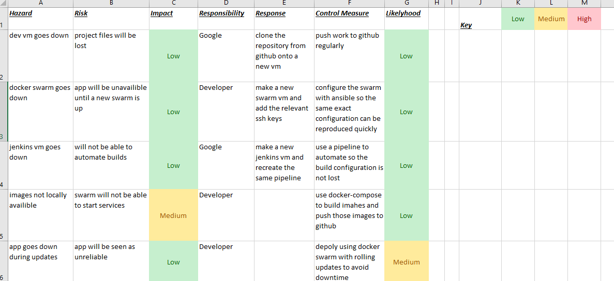

# App Design :

As a response to the brief, it was decided to develop a lottery system. This uses the microservice architecture as follows:

- Front-end : Service 1: The service in which the user interacts with. This service sends requests to the other services to generate random lottery draws, displays the generated draws to the user as well as storing them in a database.

- Lotto-api : Service 2: This service receives HTTP GET requets from service 1 and responds with a randomly selected magic number chosen from a list of magic numbers using random.choice()

- LottoDraw-api : Service 3: This service receives HTTP GET requests from service 1 then responds with a randomly generated set of 5 lottery numbers using random.sample()

- Prize-api : Service 4: This service receives HTTP POST requests from service 2, which determines the the prize given based on the magic Number that was drawn. It is linked with a dictionary to what prize will be given. 

In addition to the main services, a reverse proxy using NGINX was included. The NGINX service listen on port 80 on the host machine and performs a proxy pass, directing traffic from port 80 on host machine to port 5000 on the front-end container.
Below shows the front-end of the application in action. 

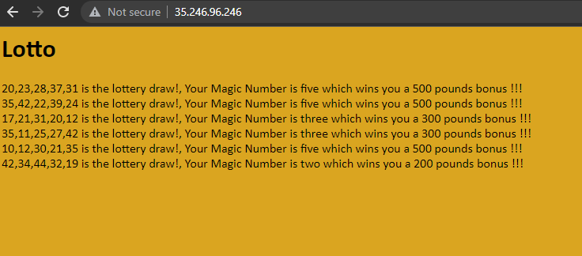

Each record for the app is saved to a MySQL Database. An entity diagram is shown below.

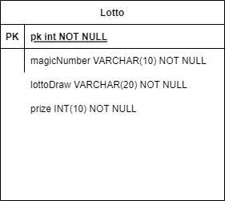

The overall microservice architecture is displayed below. 

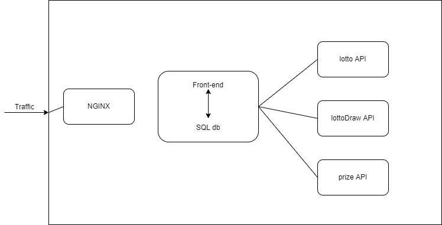

# CI/CD Pipeline :

This project uses a full CI/CD pipeline to test, build, deploy and maintain the application. The major components of this pipeline are:

- Project Tracking
- Version Control 
- Development Environment
- CI Server
- Deployment Environment

# Trello: Project Tracking

I used Trello to track my project by creating a tracking board. Story points were assigned and MoSCoW prioritisation was used to review and complete functions as the project progressed.Below is the trello board  along with a link to view the board.

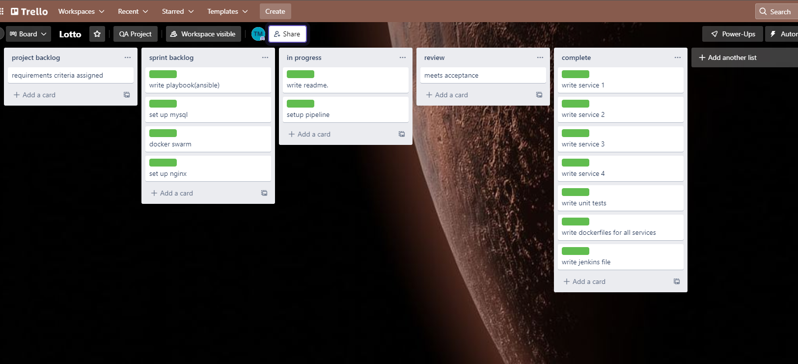

Trello Board: https://trello.com/b/DyKHpPzZ/lotto

# Git: Version Control:

Git was used for the version control of the project, the repository was hosted on github. Version Control with git allows changes to be make and commited to the project with access of commit history to access earlier versions. Using github provided webhooks which sends http POST requests to a build server to automate building and testing on Jenkins. Functions were created and updated via feature branches then merged into dev then into main. Below is a network graph of how this flowed.

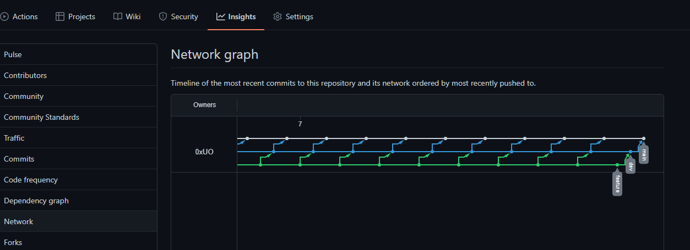

# Testing :

Testing the application is always an essential portion of the development process. Pytest was used for Unit testing the functions/functionality of the app. Unit tests were written to ensure the functions worked correctly.

We test the GET and POST requests of each relevant function to ensure that the correct data is displayed onto the page with no errors.

All the tests were 100% coverage achieved, this ensured that all of the functions of the app worked exactly as intended.
Tests were automated through Jenkins using webhooks. A Coverage report shows what percentage of statements were included in the tests, this was outputted as HTML files produced on Jenkins. Below is a visualisation of the coverage reports.

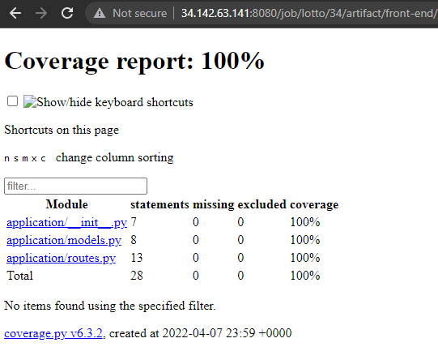
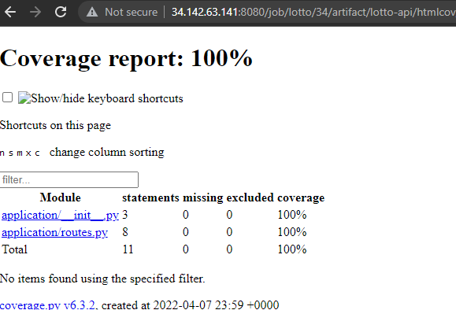
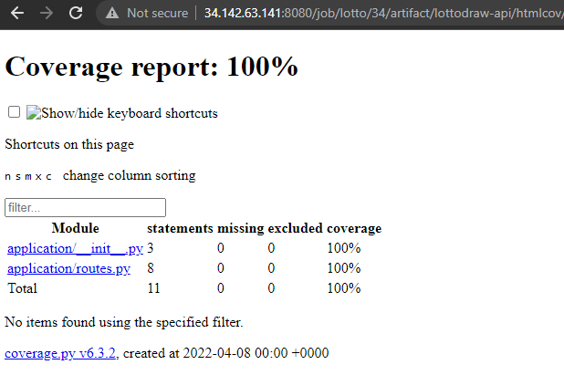
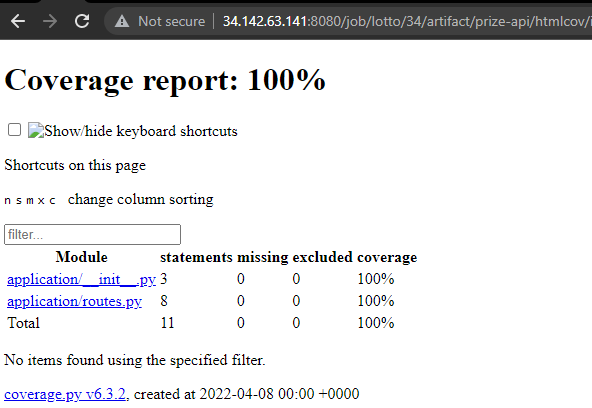

Jenkins was used as a build server, this provided automation of building and testing. Jenkins cloned the repo and executed the pipeline script defined in the Jenkinsfile. This pipeline consists of 4 main stages: test, build/push,deploy and post-build actions. The test stage executes a bash script which cycles through the directories for the four services and runs unit tests using pytest. The front-end and all APIs had unit tests written to test all areas of functionality. To test the HTTP requests made by the front-end, requests_mock was used to simulate responses from the APIs. To test the functionality of the APIs themselves, the random.choice function was patched with unittest.mock to ensure reproducible test performance. 

Below is a display of the stages on jenkins that show the test, build and deploy states of the app.

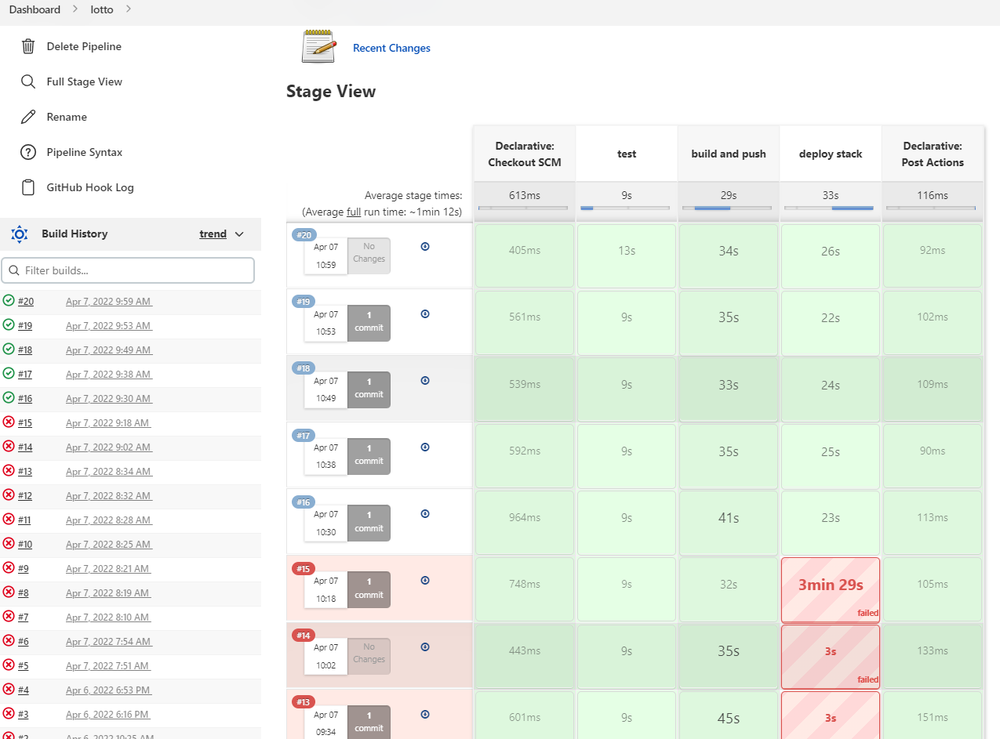

# Future  Improvements:

 the app could be improved by using another NGINX service as an external load balancer for single point of entry to the application.

# Updates : 

- Change colour scheme